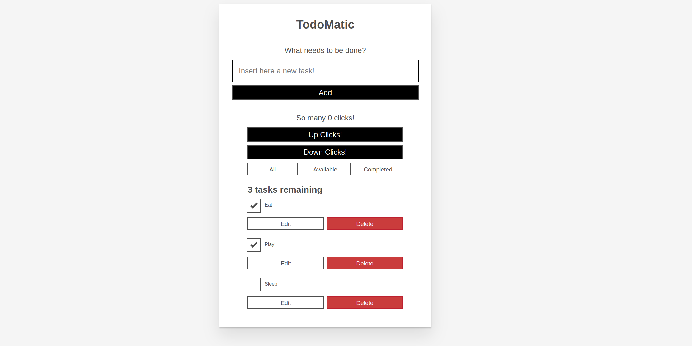

# TODO-Task List

En este proyecto desarrollamos con React una aplicación de lista de tareas, TODOs tasks.

## Entorno de desarrollo

Para este proyecto estoy usando el siguiente entorno de desarrollo:

* Contenedor Docker con todo lo necesario para empezar con React.
* Docker-Compose con el puerto 3000 expuesto que es donde se desplegará nuestra aplicación web. Además apunta a la carpeta `app` dónde se aloja nuestra aplicación.
* La carpeta `app` que es dónde se encuentra y desde donde desarrollaremos nuestra aplicacion.

## Pre Requisitos

* Hace falta tener instalado docker para poder desplegar la imagen.
* Usar VSCode con la extensión `devcontainer`

## Guía Rápida

Abrimos nuestro proyecto con el editor VSCode. Se reconocerá que el proyecto utiliza `devcontainer`. Le pedimos a VSCode que cargue el workspace de trabajo del devcontainer.

Automáticamente ya tendremos disponible nuestro entorno de desarrollo web en [`http://localhost:3000`](http://localhost:3000).

## Referencias

Para este proyecto estamos siguiendo el siguiente recurso:

* **Mozilla DEV** - [Getting started with React](https://developer.mozilla.org/en-US/docs/Learn/Tools_and_testing/Client-side_JavaScript_frameworks/React_getting_started)
* **Mozilla DEV** - [Beginning our React todo list](https://developer.mozilla.org/en-US/docs/Learn/Tools_and_testing/Client-side_JavaScript_frameworks/React_todo_list_beginning)
